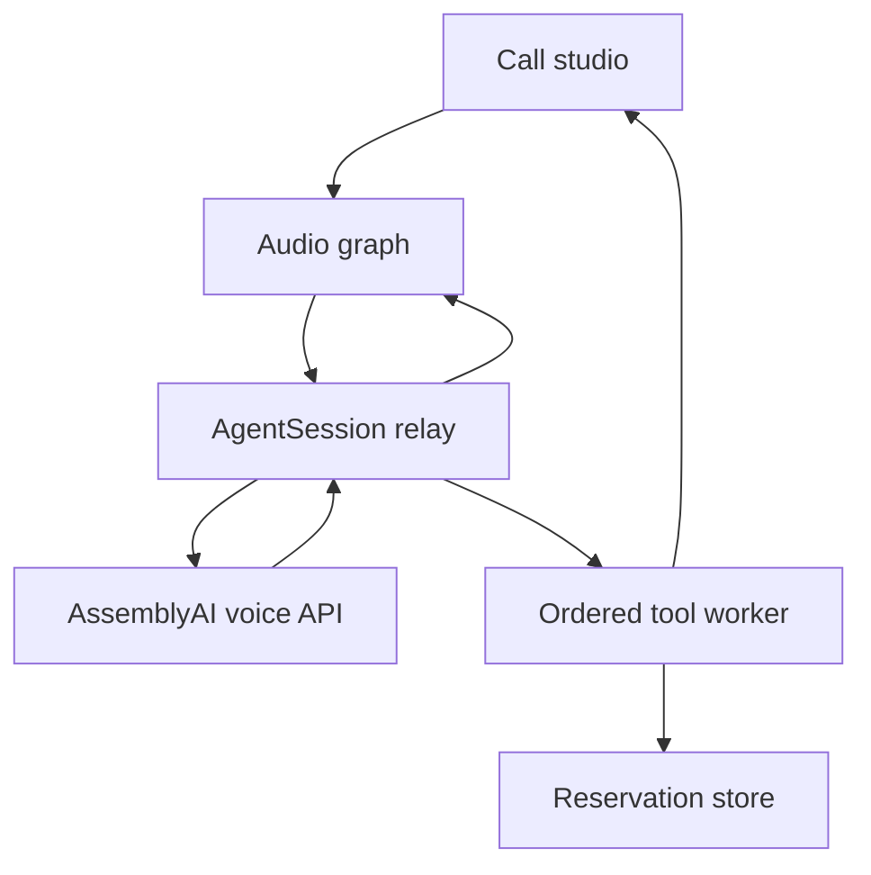

# Architecture

Tableline is the product UI for the existing restaurant calling agent. It connects
a browser microphone to AssemblyAI and turns restaurant tool results into visible
outcomes. The interactive demo is a separate, local, scripted experience.

## Boundaries

| Module | Owns |
| --- | --- |
| static/js/app.js | DOM rendering, transcript, receipt, mode selection, explicit export |
| static/js/call-session.js | Call lifecycle, socket ownership, readiness, reconnects, timing |
| static/js/audio.js | Microphone lifetime, PCM encoding, playback queue, mute, analysers |
| static/pcm-worklet.js | 20 ms capture frames and resampling to 24 kHz |
| static/js/visualizer.js | Canvas rendering from audio amplitude; motion and visibility preferences |
| static/js/demo.js | Scripted demo choices and simulated results; no microphone, socket or tools |
| main.py | Static files, public experience metadata, health, voices, WebSocket entrypoint |
| session.py | Two audio pumps, one ordered tool worker, tool-result delivery and cleanup |
| transport/ | Channel-specific framing behind AudioTransport |
| restaurant.py | Deterministic capacity/booking logic and structured receipts |
| agent_config.py | Existing prompt, voice, tool schema and dispatch |

The client has no runtime framework or build step. Its fonts are served locally.
Node dependencies are for tests and formatting only; they are excluded from
Docker and Vercel uploads.

## Call lifecycle and audio

The call controller owns one generation token. Every asynchronous callback checks
that it still belongs to the current call and socket. Cancelling while a microphone
permission request is pending releases a late stream and cannot restart the call.

An open browser WebSocket is not proof that the voice agent is ready. Capture
frames are forwarded only after session.ready. The caller can cancel during setup;
a readiness deadline prevents an indefinite connecting state.

The AudioContext is created and resumed in the user gesture task. Capture is
PCM16, mono, 24 kHz, in 20 ms frames. Playback starts with a 20 ms cushion and
schedules chunks contiguously. An analyser on the playback path drives the visual;
the microphone analyser drives it when the caller speaks. Speaking state lasts
until scheduled audio ends, even if reply.done has already arrived.

Barge-in still follows the provider's input.speech.started signal and the existing
allow_interruptions setting. The relay clears queued audio and suppresses late
chunks until a new reply.started. Transient socket failure retains the audio
graph and selected mute state, drops stale playback, and resumes the same session. Reconnects share a 25-second
total budget, so slow handshakes cannot extend retries indefinitely.

Backpressure is bounded: an upload socket with more than 128 KiB queued ends the
call with an explicit error. A playback queue over 15 seconds also stops explicitly.
Neither path silently discards words and then pretends the conversation succeeded.

## Tool execution

The audio reader enqueues tool calls without awaiting their execution. A separate
worker runs them in arrival order, so an availability check precedes the next
booking action while incoming audio and interruption events remain responsive.
The queue accepts at most 16 pending actions.

Tool results still wait until reply.done when a reply is active. A two-second
guard releases them if that event is missing. The guard never cancels itself
while awaiting an upstream send. Pump shutdown cancels the worker and guard and
clears unsent results. Cancelling an asyncio task cannot reverse a synchronous
tool already running in a thread: an in-flight mutation may finish after hangup.
Do not automatically retry an unverified booking under a new call ID.

Repeated tool call IDs return the cached result within the current AgentSession,
without running the side effect again. This cache is not durable or shared across
new relays/resumes. A production store needs durable idempotency and reconciliation.

Each action emits tool.activity with started/completed/error state. Completion means
the tool returned, including business refusals; it does not imply a booking.
Only BookingResult carries a structured receipt from a booking that exists. Spoken
responses remain strings for compatibility with the provider and existing tools.
The UI never infers success from an AI transcript or submitted arguments.

The in-memory store uses a reentrant lock for capacity check plus insert, so
simultaneous calls in one process cannot overbook the same slot. It remains
ephemeral and is not shared between instances.

## Timing and animation

Reply wait is measured using one browser monotonic clock, from receipt of
input.speech.stopped to the scheduled start of the first reply chunk. It includes
the playback cushion. It excludes the preceding voice activity detection delay,
earlier network time, and hardware output latency. It is not an end-to-end speech
latency benchmark. Greetings and the scripted demo do not emit samples.

The Canvas 2D visual runs at about 30 frames per second, caps device pixel ratio
at two, and pauses while hidden or outside the viewport. Reduced-motion preference
renders a static field. There are no particle objects allocated per frame and no
per-frame DOM updates. Transcript DOM growth is bounded while the export retains
the full conversation.

## Privacy and deployment limits

Transcripts and action results are held in tab memory and exported only on request.
The browser stores only voice preference. The provider processes audio and can
retain session recordings/transcripts under its own settings. Tool-result logs
omit caller names, phone numbers, and notes.

This is a browser calling prototype. Telephone-number integration is not implemented.
The existing Google Cloud and Vercel deployment paths are retained. Public deployment
still needs access control, usage limits, a durable transactional reservation store,
and explicit provider retention settings. These are not implemented by the UI update.

## Verification

- Python relay/domain tests use a mock upstream and verify real local tool execution.
- Native Node tests exercise call cancellation, readiness, reconnects, backpressure,
  PCM conversion, playback state, and timing with controlled audio/socket dependencies.
- jsdom tests exercise the actual page/controller and scripted demo, including changing
  a booking time and cancelling. They are DOM interaction tests, not visual screenshots.
- A real provider key is required for voice quality and end-to-end latency measurement.
  No live provider benchmark was run for this change.
- Visual browser review was blocked by the execution environment's browser URL policy.

References: [AssemblyAI Voice Agent API](https://www.assemblyai.com/docs/voice-agents/voice-agent-api)
and [AudioContext options](https://developer.mozilla.org/en-US/docs/Web/API/AudioContext/AudioContext).
